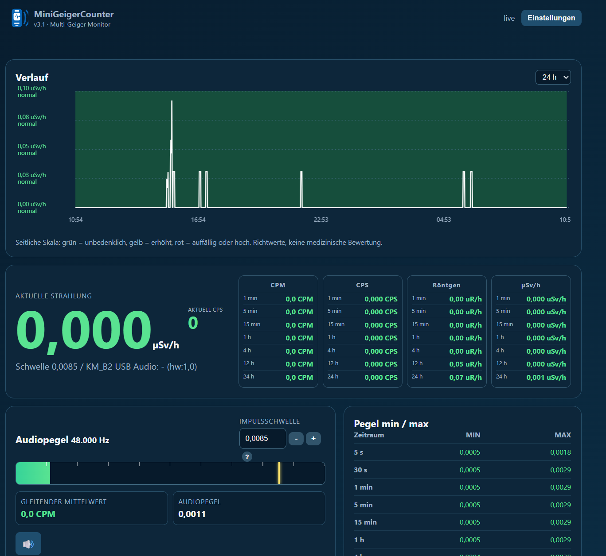

# MiniGeigerCounter v3.1.1

[Deutsch](README.md) | [English](README.en.md)

Lokaler, ressourcenschonender Raspberry-Pi-Dienst für Geigerzähler. Das Dashboard, MQTT und Home-Assistant-Discovery funktionieren ohne Cloud und teilen sich den Pi konfliktarm mit anderen Diensten.



> Beispielansicht ohne angeschlossenen Geigerzähler. Die dargestellten Messwerte dienen nur der Vorschau.

Unterstützte Zählerprofile:

| Profil | Dateneingang | Standard-Kalibrierung |
|---|---|---|
| FTLab Smart Geiger Pro SGP001 | Mikrofoneingang einer USB-Soundkarte | vorhandene SGP001-Kalibrierung |
| RadiationD v1.1 (CAJOE) | GPIO-Impuls oder abgenommener Lautsprecherimpuls per Audio | abhängig vom verbauten Rohr |
| DFRobot Gravity Geiger Counter V1 / SEN0463 | digitaler D-Ausgang über GPIO | 153,8 CPM/(µSv/h) laut Hersteller |

> Sicherheit: Am Zählrohr und auf den Platinen liegt Hochspannung an. Nur die ausdrücklich beschriebenen Niederspannungs-Pins berühren. Ein Raspberry-Pi-GPIO ist **ausschließlich 3,3 V tolerant**. Niemals ein 5-V-Ausgang direkt mit GPIO verbinden.

## Installation

```bash
git clone https://github.com/therepro21/MiniGeigerCounter.git
cd MiniGeigerCounter
sudo bash install.sh
```

Danach `http://PI-IP:8734` öffnen (**Webinterface-Port: 8734**). Rechts oben **Einstellungen** wählen, Zählermodell und Eingangsart einstellen, speichern. Der Dienst läuft als Benutzer `minigeiger`; die GPIO-Berechtigung und `gpiozero` werden durch den Installer eingerichtet. MQTT verwendet standardmäßig Port **1883**.

## Verdrahtung

Die Beispiele verwenden **BCM GPIO 17**, physischer Pin 11. Jeder andere freie BCM-Pin 0–27 kann in den Einstellungen gewählt werden.

### 1. FTLab Smart Geiger Pro SGP001 - USB-Audio

```text
Smart Geiger Pro SGP001              Raspberry Pi
┌──────────────────────┐             ┌──────────────────────────┐
│  3,5-mm-Klinke OUT   ├────────────►│ USB-Soundkarte: MIC-IN   │
└──────────────────────┘             │ USB ───────────────────► │ USB
                                     └──────────────────────────┘
```

Den SGP001 am **Mikrofoneingang**, nicht am Kopfhörer-/Line-Out der Soundkarte anschließen. In den Einstellungen `FTLab Smart Geiger Pro SGP001 (Audio)` und danach den richtigen Audio-Eingang wählen. Bei mehreren Karten helfen `arecord -l` und die Pegelanzeige beim Zuordnen.

### 2A. RadiationD v1.1 (CAJOE) - digitaler GPIO-Impuls mit AZDelivery-Pegelwandler

Der [AZDelivery 4-Kanal-Pegelwandler 5 V ↔ 3,3 V](https://www.az-delivery.de/products/4-kanal-pegelwandler-3-3v-5v) ist hierfür geeignet. Es wird nur **ein** Kanal benötigt, zum Beispiel `HV1`/`LV1`. Die Pins heißen auf baugleichen Modulen meist `HV`, `LV`, `GND`, `HV1…HV4` und `LV1…LV4`.

```text
                    Datenleitung (ein Kanal)
RadiationD*                                         AZDelivery                 Raspberry Pi
┌───────────────┐       ┌──────────────────┐       ┌──────────────────────┐    ┌─────────────────┐
│ CPM / VIN OUT ├──────►│ HV1              │       │                      │    │                 │
│               │       │                  │       │ LV1 ─────────────────┼───►│ Pin 11 / BCM 17 │
└───────────────┘       └──────────────────┘       └──────────────────────┘    └─────────────────┘

                    Versorgung und gemeinsame Masse
Raspberry Pi                         AZDelivery                         RadiationD
┌──────────────────┐                ┌──────────────────────┐          ┌───────────────┐
│ Pin 2 oder 4: 5 V├───────────────►│ HV                   │          │ +5V           │
│                  ├─────────────────────────────────────────────────►│ +5V           │
│ Pin 1: 3,3 V ────┼───────────────►│ LV                   │          │               │
│ Pin 6: GND ──────┼───────────────►│ GND                  ├─────────►│ GND           │
└──────────────────┘                └──────────────────────┘          └───────────────┘
```

| Verbindung | Von | Nach |
|---|---|---|
| 5-V-Logikversorgung | Pi Pin 2 **oder** 4 | Pegelwandler `HV` |
| 3,3-V-Logikversorgung | Pi Pin 1 | Pegelwandler `LV` |
| Gemeinsame Masse | Pi Pin 6 | Pegelwandler `GND` und RadiationD `GND` |
| RadiationD-Versorgung | Pi Pin 2 **oder** 4 | RadiationD `+5V` |
| Impuls, 5-V-Seite | RadiationD `CPM OUT`/`VIN OUT` | Pegelwandler `HV1` |
| Impuls, 3,3-V-Seite | Pegelwandler `LV1` | Pi Pin 11 / BCM 17 |

`*` Die Bezeichnung des Impulsausgangs unterscheidet sich je Boardrevision. Bei verbreiteten RadiationD-v1.1-Platinen ist der mit `VIN` beschriftete Pin der Impulsausgang; Beschriftung und Schaltbild der eigenen Platine haben Vorrang.

Für **Raspberry Pi 3B+, Pi 4 und Pi 5 ist die Belegung identisch**, da alle den 40-poligen Header verwenden. BCM 17 ist physischer Pin 11; Pin 1 ist 3,3 V, Pin 2/4 sind 5 V und Pin 6 ist GND. Der Pi-GPIO erhält ausschließlich das Signal von `LV1` - **nie** RadiationD `OUT` oder `HV1` direkt mit dem Pi verbinden.

Die 5-V-Pins 2 und 4 sind keine schaltbaren GPIOs, sondern direkt mit der 5-V-Versorgungsschiene des Pi verbunden. Sie können RadiationD versorgen, wenn der Pi über sein geeignetes Netzteil betrieben wird. Keine fremde 5-V-Quelle parallel auf Pin 2/4 einspeisen, wenn der Pi bereits über Micro-USB oder USB-C versorgt wird.

In Einstellungen `RadiationD v1.1 (GPIO-Impuls)`, BCM 17 und `Puls ist aktiv LOW: Ja` wählen. Die verbreitete RadiationD-Schaltung zählt die fallende Flanke.

#### Alternative: separates 5-V-Netzteil für RadiationD

Bei einem schwachen oder bereits stark belasteten Pi-Netzteil ist ein eigenes, geregeltes 5-V-Netzteil für RadiationD sinnvoll:

```text
Externes 5-V-Netzteil + ──► RadiationD +5V und Pegelwandler HV
Externes 5-V-Netzteil - ──► RadiationD GND, Pegelwandler GND und Pi Pin 6 (GND)
Pi Pin 1 (3,3 V) ─────────► Pegelwandler LV
Pegelwandler LV1 ─────────► Pi Pin 11 / BCM 17
RadiationD CPM/VIN OUT ───► Pegelwandler HV1
```

Das externe Netzteil **nicht** zusätzlich auf Pi-Pin 2/4 einspeisen, solange der Pi bereits über USB-C/Micro-USB versorgt wird. Die gemeinsame Masse ist dagegen zwingend nötig, damit der Pegelwandler ein eindeutiges Signal erhält.

#### Alternative: 5 V über USB-Port des Pi

Auch ein USB-Port des Pi kann RadiationD versorgen. Dazu ein USB-A-auf-offenes-Kabel oder eine USB-Breakout-Buchse verwenden - **nur Rot (+5 V) und Schwarz (GND)** anschließen, Datenadern Grün/Weiß unverbunden und isoliert lassen:

```text
Pi USB-A-Port / USB-Breakout        RadiationD + Pegelwandler
Rot (+5 V) ───────────────────────► RadiationD +5V und AZDelivery HV
Schwarz (GND) ────────────────────► RadiationD GND und AZDelivery GND
Pi Pin 1 (3,3 V) ─────────────────► AZDelivery LV
RadiationD CPM/VIN OUT ───────────► AZDelivery HV1
AZDelivery LV1 ───────────────────► Pi Pin 11 / BCM 17
```

Das ist elektrisch derselbe 5-V-Kreis wie die Header-Pins. Deshalb zählt die **gesamte** USB-Last: Pi 3B+ und Pi 4 stellen zusammen maximal 1,2 A an den USB-Ports bereit. Beim Pi 5 sind es 600 mA mit einem 3-A-Netzteil und bis zu 1,6 A mit einem erkannten 5-A-/27-W-Netzteil. Sind bereits USB-Soundkarten, SSDs oder andere Geräte angeschlossen, ist für RadiationD ein separates geregeltes 5-V-Netzteil oder ein aktiver USB-Hub die robustere Wahl.

#### Anschlussreihenfolge

1. Pi ausschalten; zunächst nur die Leitungen `HV`, `LV` und `GND` des Pegelwandlers prüfen.
2. RadiationD mit 5 V und GND verbinden.
3. Erst danach `CPM/VIN OUT → HV1` sowie `LV1 → BCM 17` verbinden.
4. Pi starten, im Dashboard das RadiationD-GPIO-Profil wählen und speichern.
5. Im Dashboard muss als Eingang `GPIO BCM 17 (fallende Flanke)` erscheinen. Bei abweichendem Pin diesen als BCM-Nummer eintragen, nicht als physische Pinnummer.

### 2B. RadiationD v1.1 - Lautsprecher-Signal per Audio

```text
RadiationD Mini-Lautsprecher            Koppel-/Dämpfglied             USB-Soundkarte
┌──────────────────────────┐            ┌────────────────────┐         ┌────────────────┐
│ SPK+ ─────────────────────┼───────────►│ 1 µF Kondensator   ├────────►│ MIC-IN Signal  │
│ SPK- / GND ───────────────┼───────────►│ 10 kΩ Serienwiderst.├───────►│ MIC-IN GND     │
└──────────────────────────┘            └────────────────────┘         └────────────────┘
```

Das Lautsprechersignal kann deutlich größer als ein Mikrofoneingang sein. Deshalb nur über ein Koppel-/Dämpfglied anschließen (kein direkter Anschluss) und mit hoher Impulsschwelle beginnen. In Einstellungen `RadiationD v1.1 (Lautsprecher-Audio)` sowie den betreffenden USB-Audioeingang wählen. Die Pegelanzeige dient zum sicheren Einstellen von Schwelle und Holdoff.

### 3. DFRobot Gravity Geiger Counter V1 / SEN0463 - GPIO

```text
DFRobot Gravity 3-polig                   Raspberry Pi 40-Pin
┌────────────────────────┐                ┌──────────────────┐
│ - / GND ───────────────┼───────────────►│ Pin 6: GND        │
│ + / VCC (3,3 V) ───────┼───────────────►│ Pin 1: 3,3 V      │
│ D / Signal ────────────┼───────────────►│ Pin 11: BCM 17    │
└────────────────────────┘                └──────────────────┘
```

Der DFRobot-Sensor arbeitet mit 3,3–5 V und zieht seinen digitalen Ausgang beim Impuls nach LOW. Für den direkten Pi-Anschluss daher mit **3,3 V** speisen. Bei Versorgung mit 5 V ist vor D ein 5-V→3,3-V-Pegelwandler nötig. In Einstellungen `DFRobot Gravity V1 / SEN0463 (GPIO-Impuls)`, BCM 17 und aktive LOW-Flanke wählen.

## Kalibrierung und Werte

`Aktuell CPS` zählt ausschließlich die Impulse der letzten Sekunde. CPM, Dosis, MQTT und Verlauf werden aus effizienten Zeitfenstern erzeugt; lange Historien bremsen die Erfassung nicht. Puls-, Pegel- und Zwischenwerte liegen ausschließlich im RAM. SQLite-Verlauf und geänderte Einstellungen werden gebündelt höchstens einmal pro Minute auf die microSD geschrieben.

Die Umrechnung ist immer nur so gut wie Zählrohr, Geometrie und Kalibrierung. In **Einstellungen** kann ein Referenzgerät eingetragen werden: Referenz-CPS und zugehörige µSv/h ergeben automatisch den Faktor für CPM und CPS. Beim DFRobot-SEN0463 nennt der Hersteller 153,8 CPM/(µSv/h); RadiationD ist abhängig vom konkret verbauten Rohr und muss geprüft beziehungsweise kalibriert werden.

Version 3.0 bietet zusätzlich eine Röhren-Vorauswahl. Die Werte sind typische Startwerte für Gamma-Kalibrierungen und werden beim Auswählen in die beiden Kalibrierfelder übernommen; erst **Speichern** aktiviert sie.

| Vorauswahl | CPM pro µSv/h | Hinweis |
|---|---:|---|
| M4011 / DFRobot Gravity | 153,8 | Herstellerangabe für SEN0463 |
| J305/J305β (RadiationD) | 123,15 | typischer J305-Wert |
| SBM-20 / STS-5 | 175,44 | typischer Gamma-Startwert |
| LND 712 / 7121 | 123,15 | Cs-137-Referenz, abhängig von Geometrie und Energie |
| SGP001 | 8.014,285714 | bestehende Projektkalibrierung, nicht allgemeingültig |

Diese Auswahl ersetzt kein Referenzgerät oder eine professionelle Kalibrierung. Insbesondere Alpha-/Beta-Quellen, Fensterröhren, Gehäuse und die Energie des Isotops verändern die Anzeige deutlich.

## MQTT und Home Assistant

Die Einstellungen entsprechen der vorhandenen Mosquitto-/Home-Assistant-Anbindung des PV Optimizers bzw. NoiseMeter Pro: Broker-Host, Port, Benutzername, Passwort, Basistopic, Discovery-Präfix und Discovery-Schalter. Standardbasis ist `minigeiger`, das Discovery-Präfix `homeassistant`.

| Einstellung | Beispiel / Zweck |
|---|---|
| MQTT Host / Port | `192.168.0.31` / `1883` (lokaler Mosquitto) |
| MQTT Benutzername / Passwort | eigener Mosquitto-Benutzer; Passwort leer lassen, um das gespeicherte Passwort beizubehalten |
| MQTT Topic | `minigeiger` – muss im Broker eindeutig sein |
| Home-Assistant Discovery-Präfix | üblicherweise `homeassistant` |
| Home-Assistant-Discovery | legt die Sensoren automatisch in Home Assistant an |

| Topic | Inhalt |
|---|---|
| `minigeiger/radiation_usvh` | Dosisleistung in µSv/h |
| `minigeiger/cpm` | CPM, 1-Minuten-Fenster |
| `minigeiger/cps` | CPS, ausschließlich Impulse der letzten Sekunde |
| `minigeiger/count_total` | interne Gesamtzählung für die Historie |
| `minigeiger/status` | `online` oder `offline` |

MQTT und automatische Home-Assistant-Discovery werden in Einstellungen aktiviert. Bei aktivierter Discovery erscheinen Dosisleistung, CPM, CPS und Verbindung automatisch als Geräteentitäten von **MiniGeigerCounter**. Alle Messwerte sowie der Verbindungsstatus sind retained, damit Home Assistant sofort nach einem Neustart einen gültigen Zustand erhält.

## Update über das Webinterface

In **Einstellungen → Programm-Update** prüft **Update prüfen** die veröffentlichte Version auf GitHub. Für **Update installieren** wird ein persönlicher Update-Code benötigt. Er wird beim normalen Speichern der Einstellungen erstmals gesetzt (mindestens 16 Zeichen) und danach aus Sicherheitsgründen nicht mehr angezeigt.

Das Update führt ausschließlich einen Fast-Forward-Pull aus dem beim Installer verwendeten Git-Repository aus und startet anschließend den Dienst neu. Lokale, nicht committete Änderungen im Repository werden nicht überschrieben; dann wird das Update abgebrochen und in `/var/log/minigeiger-update.log` dokumentiert.

Nach dem Upgrade auf v3.1 muss der Installer einmalig manuell ausgeführt werden, damit der geschützte Aktualisierer installiert wird:

```bash
cd ~/MiniGeigerCounter
git pull origin main
sudo bash install.sh
```

Ein automatisches Update bei jedem Raspberry-Pi-Start ist absichtlich nicht aktiviert. Messbetrieb und Kalibrierung bleiben damit auch dann verfügbar, wenn GitHub oder das Netzwerk gerade nicht erreichbar sind oder eine Version unerwartet Probleme verursacht.

## Wartung und Diagnose

```bash
sudo systemctl status minigeiger --no-pager
sudo journalctl -u minigeiger -n 80 --no-pager
sudo systemctl restart minigeiger
arecord -l
```

Konfiguration und Datenbank liegen in `/var/lib/minigeiger/`; die Anwendung selbst in `/opt/minigeiger/`.

## Quellen und technische Hinweise

- [DFRobot SEN0463 Herstellerdokumentation](https://wiki.dfrobot.com/sen0463/): 3,3–5-V-Versorgung, D-Ausgang, aktive LOW-Pulse und 153,8 CPM/(µSv/h).
- [RadiationD-v1.1 Referenzprojekt](https://github.com/SensorsIot/Geiger-Counter-RadiationD-v1.1-CAJOE-): Schaltbild und Impulsausgang der Boardfamilie.
- [RadiationD-Pulszählbeispiel](https://devices.esphome.io/devices/geiger-counter/): fallende Flanke und Hinweise zum J305-Rohr.
